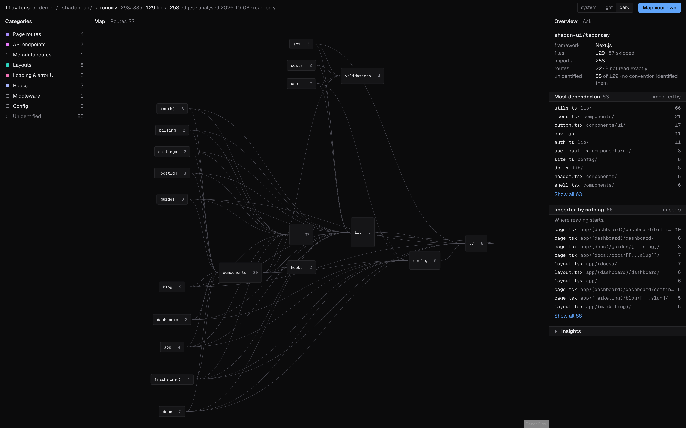

# Flowlens

**Flowlens parses a public TypeScript or JavaScript repository and draws what imports what, with every line traced to an import that resolved to a real file.**

<!-- The live address is the Vercel project's production domain; update it if the project is renamed. -->
**Live:** https://flowlens-rouge.vercel.app · **Demo, no sign-in:** https://flowlens-rouge.vercel.app/demo

[](https://flowlens-rouge.vercel.app/demo)

## What's different

Most tools that "explain a codebase" ask a model what's there. Flowlens asks the TypeScript compiler. An edge on the map exists only because an import resolved to a real file in the repository. An import that can't be resolved isn't drawn; it's counted, with the reason. A route whose full path can't be read from the syntax isn't shown at all.

The model comes in afterwards, and only to explain what the parser found: a paragraph about a file written from its real neighbours, or an answer to a question that it has to look up in the parsed map first. Every lookup is shown before the answer. Every explanation is checked for file paths the model was never shown.

It doesn't grade the code. No scores, no "issues found". It explains a codebase; it doesn't review one.

## What it does

- **Dependency map.** Folders fold into boxes and open into their files. Fan-in and fan-out for every file.
- **What it uses, what uses it.** Select a file to highlight its imports and its importers.
- **Blast radius and dependency chain.** Everything two imports away in either direction, walked over the parsed edges.
- **Framework adapters.** Next.js, NestJS, Express and React name each file's role and pull out routes.
- **Coverage.** How much of the repository was parsed, and why the rest wasn't.
- **Live progress** while a repository is downloaded, parsed and stored.
- **Explanations** of a file or folder, cached and traced.
- **Ask the repository.** A chat panel answered by an agent that can only look facts up.
- **Pull request previews.** The map of a PR's head, with what it changed.
- **Map access for coding agents** over MCP. See [docs/coding-agents.md](docs/coding-agents.md).
- **Teams.** Each analysis belongs to an organization, and row-level security decides who can read it.

## Architecture

```
GitHub archive ─▶ parser ─▶ adapters ─▶ Postgres (RLS) ─▶ map, graph functions, AI
```

- **Parser** (`lib/parser`). Path in, data out. It reads imports, re-exports, dynamic imports and `require()` through the TypeScript compiler and resolves each one through path aliases, index files and workspace packages. It doesn't import Next.js, React or the database client, so it runs from a plain script (`pnpm parse`).
- **Adapters** (`lib/adapters`). All framework knowledge lives here, never in the parser.
- **Graph functions** (`lib/graph`). Pure functions over a file list and an edge list. Blast radius and dependency chain are the same walk with a direction and a depth limit.
- **Pipeline** (`lib/pipeline`). Fetch, select, parse, store, with named stages published to the database. The page subscribes to them over realtime.
- **Row-level security** (`supabase/migrations`). Every table is scoped to a Clerk organization by a policy that reads the organization claim from the session token. Application code never filters by organization. Every migration ends by refusing to apply if any table in `public` lacks RLS or a policy.
- **AI** (`lib/ai`). One module builds the model client and wraps it for tracing. Every call reads the cache inside its trace, so a cache hit is recorded as a run with no model call in it.
- **Agent** (`agent/`). A separate service with its own dependencies. Its tools call back into `/api/agent/*` with a short-lived credential minted by the database for one analysis.

## Stack

| Area    | Choice                                                 |
| ------- | ------------------------------------------------------ |
| App     | Next.js 16 (App Router), React 19, TypeScript (strict) |
| Parsing | ts-morph (the TypeScript compiler API)                 |
| Map     | React Flow, dagre                                      |
| Auth    | Clerk (sign-in and organizations)                      |
| Data    | Supabase Postgres, row-level security, realtime        |
| AI      | OpenAI SDK against Gemini's OpenAI-compatible endpoint |
| Tracing | LangSmith                                              |
| Agent   | Managed Deep Agents, run as a separate service         |
| Styling | Tailwind CSS v4                                        |
| Hosting | Vercel Hobby, Web Analytics                            |

## Answer check

The chat agent was measured in Phase 15. For each repository, 24 questions are generated from the parsed map (which files import X, what X imports, its blast radius, its dependency chain), with the expected files taken from the same edges. Each is asked three times. An answer is scored by F1 between the files it names and the files expected.

| Repository                 | Commit    | Answers scored | Mean F1 | Invented files | Answers with no lookup |
| -------------------------- | --------- | -------------- | ------- | -------------- | ---------------------- |
| immerjs/immer              | `8848a5b` | 72 of 72       | 1.00    | 0              | 0                      |
| shadcn-ui/taxonomy         | `298a885` | 19 of 72       | 1.00    | 0              | 0                      |
| alan2207/bulletproof-react | not run   | —              | —       | —              | —                      |

The taxonomy run stopped when Gemini's free daily quota ran out; bulletproof-react hasn't been run for the same reason. The full reports are in `evals/answers/`.

**What this proves:** on these questions the agent looks the answer up rather than recalling it, relays what the lookup returned without dropping, adding or inventing files, and does so the same way across rounds.

**What it doesn't prove:** the expected answers come from the same parser the agent reads, so a parser mistake would be scored as correct. It doesn't measure open-ended questions, the quality of the prose, or the written explanations. One repository has been measured in full.

## Run it locally

You need Node 26, pnpm (the version is pinned in `package.json`), a Clerk application, a Supabase project and a Gemini API key.

1. **Clone and install.**

   ```sh
   git clone https://github.com/UzairJIqbal/flowlens.git
   cd flowlens
   pnpm install
   ```

2. **Clerk.** Create an application and enable Organizations.

3. **Supabase.** Create a project and add Clerk as a third-party auth provider, so Postgres accepts Clerk session tokens. Apply the migrations in `supabase/migrations` in order, for example with `supabase db push`.

4. **GitHub token.** Create a fine-grained personal access token with **Public repositories (read-only)** access and nothing else.

5. **Environment.** Copy `.env.example` to `.env.local` and fill it in. The app refuses to start, build or generate types while a required variable is missing.

6. **Check and run.**

   ```sh
   pnpm typecheck && pnpm lint && pnpm test && pnpm build
   pnpm dev
   ```

   Open http://localhost:3000.

7. **Agent (optional, for the chat panel).**

   ```sh
   cd agent
   cp .env.example .env
   pnpm install
   pnpm dev
   ```

   It listens on http://localhost:2024. The app reaches it through `AGENT_URL`.

## Environment variables

App (`.env.local`; on Vercel, set separately for Production and Preview):

| Name                                              | Required | Purpose                                         |
| ------------------------------------------------- | -------- | ----------------------------------------------- |
| `NEXT_PUBLIC_CLERK_PUBLISHABLE_KEY`               | Yes      | Clerk, browser                                  |
| `CLERK_SECRET_KEY`                                | Yes      | Clerk, server                                   |
| `NEXT_PUBLIC_CLERK_SIGN_IN_URL`                   | Yes      | Sign-in route                                   |
| `NEXT_PUBLIC_CLERK_SIGN_UP_URL`                   | Yes      | Sign-up route                                   |
| `NEXT_PUBLIC_CLERK_SIGN_IN_FALLBACK_REDIRECT_URL` | Yes      | Where sign-in lands                             |
| `NEXT_PUBLIC_CLERK_SIGN_UP_FALLBACK_REDIRECT_URL` | Yes      | Where sign-up lands                             |
| `NEXT_PUBLIC_SUPABASE_URL`                        | Yes      | Supabase project URL                            |
| `NEXT_PUBLIC_SUPABASE_PUBLISHABLE_KEY`            | Yes      | Supabase, browser and RLS-scoped queries        |
| `SUPABASE_SECRET_KEY`                             | Yes      | Supabase, pipeline writes                       |
| `GOOGLE_API_KEY`                                  | Yes      | Model calls                                     |
| `GH_READ_TOKEN`                                   | Yes      | The app's own read-only token for GitHub's API  |
| `LANGSMITH_TRACING`                               | No       | Turns tracing on                                |
| `LANGSMITH_ENDPOINT`                              | No       | LangSmith API                                   |
| `LANGSMITH_API_KEY`                               | No       | LangSmith, needed for the evals                 |
| `LANGSMITH_PROJECT`                               | No       | LangSmith project name                          |
| `AGENT_URL`                                       | No       | Agent service; without it the Ask panel says so |

Agent (`agent/.env`): `GOOGLE_API_KEY`, `LANGSMITH_TRACING`, `LANGSMITH_API_KEY`, `LANGSMITH_PROJECT` and `FLOWLENS_URL`.

## Scripts

| Script                                      | What it does                                                    |
| ------------------------------------------- | --------------------------------------------------------------- |
| `pnpm dev`                                  | Development server                                              |
| `pnpm build` / `pnpm start`                 | Production build and server                                     |
| `pnpm lint`                                 | ESLint                                                          |
| `pnpm typecheck`                            | Generates route types, then runs `tsc`                          |
| `pnpm test`                                 | Unit tests (`node --test`)                                      |
| `pnpm parse <dir> [--out file] [--skipped]` | Runs the parser on a directory on disk and prints the result    |
| `pnpm analyze <github url> --org org_...`   | Runs the full pipeline from a terminal for one organization     |
| `pnpm demo:export <analysis id>`            | Writes a stored analysis out as the public demo's snapshot      |
| `pnpm eval:paths`                           | Checks recent explanations for invented paths (needs LangSmith) |
| `pnpm eval:roles`                           | Measures model role labels against convention (needs LangSmith) |
| `pnpm eval:prompts`                         | Compares prompt versions (needs LangSmith)                      |
| `pnpm eval:answers <clone dir>`             | The answer check above (needs LangSmith and the agent)          |

CI runs lint, typecheck, tests and build for the app, and a typecheck for the agent, on every pull request.

## The live site, and its limits

Everything runs on free plans, and the limits are stated rather than engineered around.

- **Sign-in shows a small Clerk development banner.** Clerk's production instance needs a domain you own and doesn't work on a `vercel.app` address, so the live site runs on the development instance.
- **The database may be asleep.** Supabase's free plan pauses a project after a week with no activity. The landing page and the demo don't touch the database, so they always load; signing in to a paused project fails until it's restored.
- **No chat on the live site.** The agent is a separate long-running service and isn't hosted. The Ask panel says so. It works when you run Flowlens yourself.
- **Daily limits per organization**, counted in the database and reset at midnight UTC: 10 analysis runs, 100 explanations, 30 questions. They keep Gemini's free quota usable for everyone. When the limit or the quota runs out, the app says which.
- **Archives over 100 MB are refused.** A run parses inside one function, and Vercel Hobby stops a function at 300 seconds.
- **Public repositories only.** GitHub's API is read with the app's own token, which can read public data and nothing else. No user's token is ever stored.

## License

[MIT](LICENSE)
